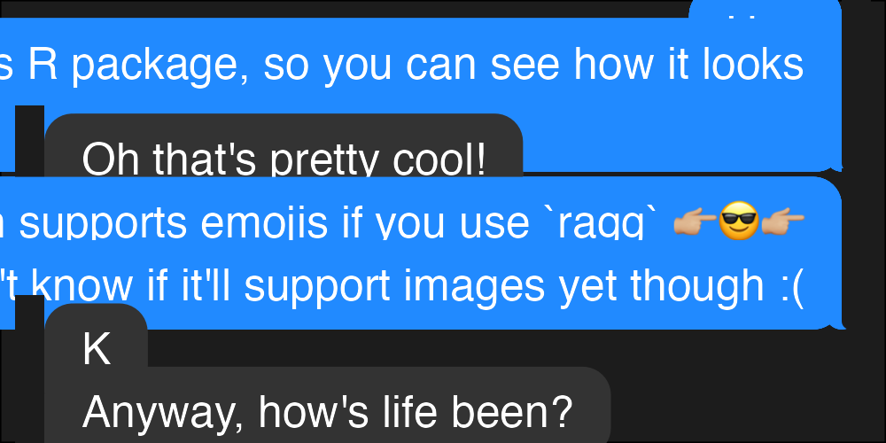

<!-- README.md is generated from README.Rmd. Please edit that file -->

# chatterbox

<!-- badges: start -->

<!-- badges: end -->

``` r
library(chatterbox)

file <- knitr::fig_path('.png')
ragg::agg_png(file, width = 1000, height = 500, res = 300)
conversation |>
  chat(me = "Alice")
dev.off()
#> quartz_off_screen 
#>                 2
knitr::include_graphics(file)
```


