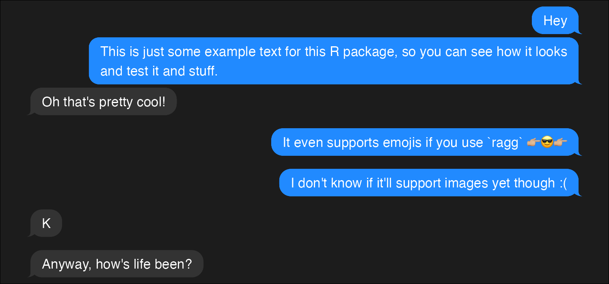
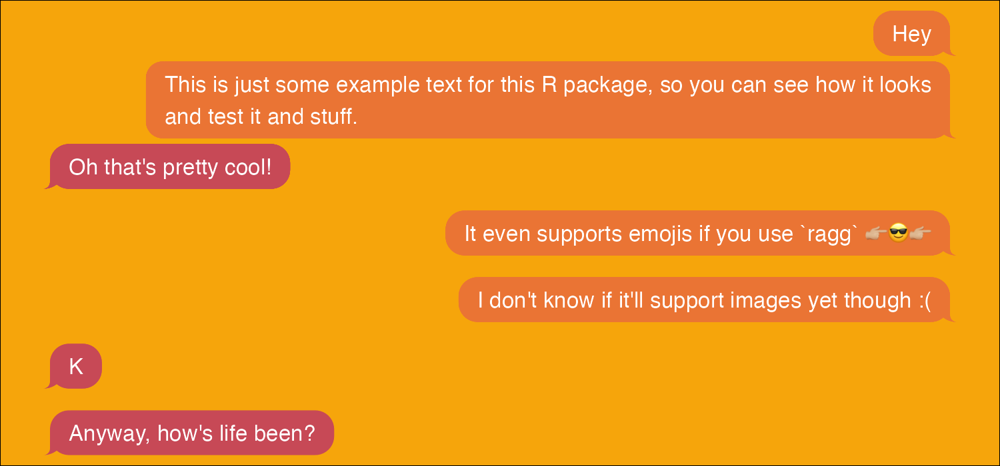

<!-- README.md is generated from README.Rmd. Please edit that file -->

# chatterbox

<!-- badges: start -->

<!-- badges: end -->

`chatterbox` lets you make figures of text messages fairly painlessly.

``` r
library(chatterbox)
```

A basic conversation is included to get you started:

``` r
conversation
#>          message_date
#> 1 2024-11-05 11:11:11
#> 2 2024-11-05 11:11:12
#> 3 2024-11-05 11:20:01
#> 4 2024-11-06 12:02:10
#> 5 2024-11-06 12:02:11
#> 6 2024-11-06 13:42:11
#> 7 2024-11-06 17:10:42
#>                                                                                                    text
#> 1                                                                                                   Hey
#> 2 This is just some example text for this R package, so you can see how it looks and test it and stuff.
#> 3                                                                                Oh that's pretty cool!
#> 4                                                  It even supports emojis if you use `ragg` 👉🏼😎👉🏼
#> 5                                                    I don't know if it'll support images yet though :(
#> 6                                                                                                     K
#> 7                                                                              Anyway, how's life been?
#>   sender_name
#> 1       Alice
#> 2       Alice
#> 3         Bob
#> 4       Alice
#> 5       Alice
#> 6         Bob
#> 7         Bob
```

Minimally, all you need to do is supply the data and who you want to be
on the right (`me`):

``` r
file <- knitr::fig_path('.png')
ragg::agg_png(file, width = 1500, height = 700, res = 200)
conversation |>
  chat(me = "Alice")
dev.off()
#> quartz_off_screen 
#>                 2
knitr::include_graphics(file)
```

 You
can also change the theme (with the `theme` argument – either “light” or
“dark”) or make your own (with `make_theme`):

``` r
fiery <- make_theme(
  text_me = "white",
  text_you = "white",
  fill_me = "#ea7434",
  fill_you = "#c74956",
  bg =  "#f6a50b"
)

file <- knitr::fig_path('.png')
ragg::agg_png(file, width = 1500, height = 700, res = 200)
conversation |>
  chat(me = "Alice", theme = fiery)
dev.off()
#> quartz_off_screen 
#>                 2
knitr::include_graphics(file)
```


